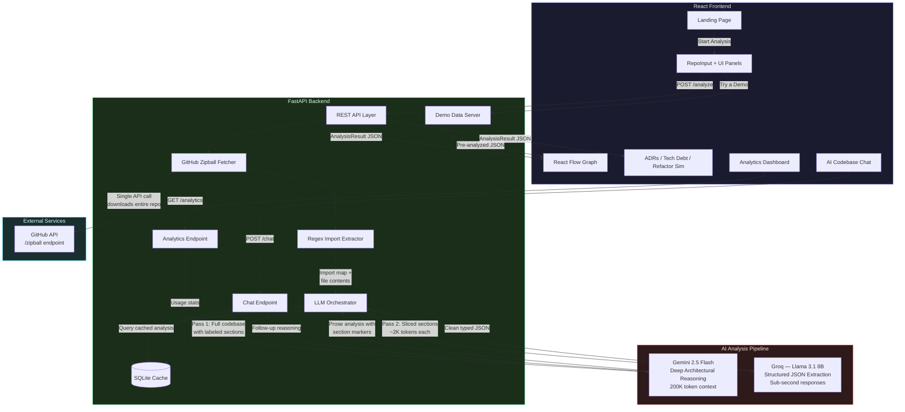

<p align="center">
  <pre align="center">
  ╔═══════════════════════════════════════════════════════════╗
  ║                                                           ║
  ║   ███████╗ ██████╗ ███████╗███████╗██╗██╗      █████╗ ██╗ ║
  ║   ██╔════╝██╔═══██╗██╔════╝██╔════╝██║██║     ██╔══██╗██║ ║
  ║   █████╗  ██║   ██║███████╗███████╗██║██║     ███████║██║ ║
  ║   ██╔══╝  ██║   ██║╚════██║╚════██║██║██║     ██╔══██║██║ ║
  ║   ██║     ╚██████╔╝███████║███████║██║███████╗██║  ██║██║ ║
  ║   ╚═╝      ╚═════╝ ╚══════╝╚══════╝╚═╝╚══════╝╚═╝  ╚═╝╚═╝ ║
  ║                                                           ║
  ║            🦴  AI Code Archaeologist  🦴                 ║
  ║                                                           ║
  ╚═══════════════════════════════════════════════════════════╝
  </pre>
</p>

<h3 align="center">Reverse-engineer the <em>intent</em> behind any GitHub repository.<br/>Think of it as giving every codebase a senior engineer's code review.</h3>

<p align="center">
  <a href="https://www.python.org/"></a>
  <a href="https://react.dev/"></a>
  <a href="https://ai.google.dev/"></a>
  <a href="https://groq.com/"></a>
  <a href="https://fastapi.tiangolo.com/"></a>
  <a href="LICENSE"></a>
</p>

---

## What It Does

FossilAI takes any public GitHub repository URL and produces a full architectural analysis — the kind a senior engineer would give after spending a week reading the codebase. Nine features, zero manual effort:

- **Interactive Dependency Graph** — Visualize how every file and module connects. Zoom, pan, click through nodes. Color-coded by language and tech debt severity.
- **Auto-Generated ADRs** — Architectural Decision Records that explain *why* things were built a certain way. The decisions no one documented but everyone needs to understand.
- **Tech Debt Heatmap** — A color-coded map of your codebase's health. Green is clean. Red is where bugs are hiding. Hover for details, click to navigate.
- **"What If?" Refactor Simulation** — Ask "What happens if I extract auth into a microservice?" and get an impact assessment with affected files, risk level, and a before/after graph diff.
- **Export as Markdown / PNG / ZIP** — Download the full analysis, the dependency graph as an image, or everything bundled as a zip. Hand it to any new engineer joining the team.
- **AI Codebase Chat** — Switch to the "Ask" tab and chat with the codebase. Ask questions like "Why was this architecture chosen?" or "What would break if I deleted the auth module?" Powered by cached Gemini analysis — no re-processing needed.
- **Pre-Analyzed Demo Repos** — Click "Try a Demo" to instantly explore a full Express.js analysis with zero API calls. Recruiter-proof — works even if APIs are down.
- **Landing Page** — Beautiful hero section with scroll animations, feature cards, "How it works" steps, and tech stack badges. First impression in 5 seconds.
- **Analytics Dashboard** — Track repos analyzed, files scanned, most common architecture patterns, and analysis history. Click any past analysis to reload it instantly.

---

## Demo

> Paste a GitHub URL → watch the AI analyze → explore the interactive results


*Input a repo URL → Loading states (Fetching → Parsing → Analyzing → Extracting) → Interactive dependency graph appears → Click nodes to see file details and ADRs → Explore the tech debt heatmap → Run a refactor simulation → Export everything as Markdown*

---

## Architecture



---

## Tech Stack

| Layer | Technology | Why |
|-------|-----------|-----|
|  | React 18 + Vite + React Flow | Interactive graph, fast HMR, Vercel-ready |
|  | Tailwind CSS | Rapid UI iteration, consistent design system |
|  | Python FastAPI | Async-first, lightweight, excellent for orchestrating API calls |
|  | Gemini 2.5 Flash API | Large context window for deep architectural reasoning |
|  | Groq API (Llama 3.1 8B) | Sub-second structured JSON extraction |
|  | SQLite (aiosqlite) | Zero-config persistent cache for analysis results |

---

## How It Works — Two-Pass LLM Strategy

FossilAI uses a **two-pass architecture** that plays to each model's strength:

### Pass 1: Gemini 2.5 Flash — Deep Reasoning

The full codebase (file tree + contents + regex-extracted import map) is sent to Gemini with a structured prompt. Gemini excels at reasoning over large contexts — it reads the entire codebase and produces a detailed prose analysis organized into labeled sections: `[ARCHITECTURE]`, `[DECISIONS]`, `[TECH_DEBT]`, `[DEPENDENCIES]`, and `[REFACTORING]`.

For large repos, files are chunked at **200K tokens per request** with 60-second cooldowns between API calls to stay within free-tier limits.

### Pass 2: Groq (Llama 3.1 8B) — Structured Extraction

Gemini's output is **sliced by section label** — each section is sent independently to Groq. This keeps every Groq call under 4K tokens (well within the ~6-8K context window) and returns clean, typed JSON in sub-second response times.

```
Codebase ──→ [Gemini: reasons deeply] ──→ Labeled prose analysis
                                              │
                    ┌─────────────────────────┼─────────────────────────┐
                    ▼                         ▼                         ▼
            [DECISIONS] section      [TECH_DEBT] section      [DEPENDENCIES] section
                    │                         │                         │
                    ▼                         ▼                         ▼
              [Groq: extract]          [Groq: extract]          [Groq: extract]
                    │                         │                         │
                    ▼                         ▼                         ▼
              ADRs (JSON)           Tech Debt Items (JSON)    Graph Nodes+Edges (JSON)
```

**Why two passes?** Gemini reasons brilliantly but is slow and unreliable for structured output. Groq is blazing fast at JSON extraction but has a tiny context window. Splitting the work gets the best of both.

### Bonus: AI Codebase Chat

Once analysis is cached, users can switch to the **"Ask" tab** and ask follow-up questions about the codebase in natural language. The cached Gemini analysis is sent as context — no re-processing, no extra API calls for the initial analysis. Gemini answers questions like "Why was this architecture chosen?" or "What would break if I deleted the auth module?" with full codebase awareness.

---

## Quick Start

### Prerequisites

- Python 3.11+
- Node.js 18+
- API keys for [Gemini](https://ai.google.dev/), [Groq](https://console.groq.com/), and optionally [GitHub](https://github.com/settings/tokens)

### 1. Clone the repository

```bash
git clone https://github.com/yourusername/FossilAI.git
cd FossilAI
```

### 2. Set up the backend

```bash
cd backend
python -m venv venv
source venv/bin/activate   # Windows: venv\Scripts\activate
pip install -r requirements.txt
```

### 3. Configure environment variables

```bash
cp .env.example .env
# Edit .env with your API keys
```

```env
GEMINI_API_KEY=your_gemini_api_key_here
GROQ_API_KEY=your_groq_api_key_here
GITHUB_TOKEN=your_github_token_here   # Optional — increases rate limit from 60 to 5000 req/hr
```

### 4. Set up the frontend

```bash
cd ../frontend
npm install
```

### 5. Run both servers

**Backend** (from `backend/`):
```bash
uvicorn main:app --reload --port 8000
```

**Frontend** (from `frontend/`):
```bash
npm run dev
```

Open **http://localhost:5173** and paste any public GitHub repo URL.

---

## Why I Built This

Every engineering team has that one codebase nobody fully understands. The original authors have moved on, the README is three years stale, and the architecture lives as tribal knowledge in someone's head. I built FossilAI to solve this — an AI that can read an entire repository and produce the documentation, dependency maps, and architectural insights that should have existed from day one.

This project sits at the intersection of AI engineering and product thinking: choosing the right model for each task (Gemini for reasoning, Groq for speed), designing a chunking strategy that works within free-tier constraints, and building a frontend that makes complex analysis results actually useful. It's the kind of tool I wish existed every time I onboarded onto a new codebase.

---

## Project Structure

```
FossilAI/
├── backend/
│   ├── main.py                     # FastAPI entry point
│   ├── config.py                   # API keys + rate limit constants
│   ├── routers/
│   │   ├── analyze.py              # POST /analyze — main pipeline
│   │   ├── refactor.py             # POST /refactor — "what if" simulation
│   │   ├── chat.py                 # POST /chat — AI codebase Q&A
│   │   ├── demo.py                 # GET /demo — pre-analyzed demo data
│   │   ├── analytics.py            # GET /analytics — usage stats + history
│   │   └── health.py               # GET /health
│   ├── services/
│   │   ├── github_fetcher.py       # Zipball download + in-memory extraction
│   │   ├── import_extractor.py     # Regex-based import parsing (6 languages)
│   │   ├── gemini_analyzer.py      # Pass 1: deep analysis via Gemini
│   │   ├── groq_extractor.py       # Pass 2: structured JSON via Groq
│   │   ├── section_slicer.py       # Slice Gemini output into per-section chunks
│   │   ├── chunker.py              # Smart file chunking (200K token cap)
│   │   └── cache.py                # SQLite caching layer
│   ├── demo_data/                  # Pre-analyzed demo repo JSON files
│   └── models/
│       ├── schemas.py              # Pydantic models for all types
│       └── prompts.py              # LLM prompt templates
│
├── frontend/
│   ├── src/
│   │   ├── App.jsx                 # Layout + routing
│   │   ├── context/
│   │   │   └── AnalysisContext.jsx  # Global state management
│   │   ├── components/
│   │   │   ├── LandingPage.jsx     # Hero section + feature cards + scroll animations
│   │   │   ├── RepoInput.jsx       # URL input + analyze trigger
│   │   │   ├── DependencyGraph.jsx # React Flow interactive graph
│   │   │   ├── NodeDetail.jsx      # File details on node click
│   │   │   ├── ADRPanel.jsx        # Architectural Decision Records
│   │   │   ├── TechDebtMap.jsx     # Heatmap visualization
│   │   │   ├── RefactorSim.jsx     # "What if?" simulation UI
│   │   │   ├── ChatPanel.jsx       # AI codebase chat interface
│   │   │   ├── AnalyticsDashboard.jsx # Usage stats + analysis history
│   │   │   └── ExportButton.jsx    # Markdown/PNG/ZIP export
│   │   ├── hooks/                  # useAnalysis, useGraphLayout
│   │   └── utils/                  # API client, graph helpers
│   └── vite.config.js
│
├── CLAUDE.md                       # AI pair-programming context
└── README.md                       # You are here
```

---

## Roadmap

- [x] ~~**AI Codebase Chat** — Ask follow-up questions about the analysis in natural language.~~
- [x] ~~**Pre-Analyzed Demo Repos** — Instantly explore analyses with zero API calls.~~
- [x] ~~**Landing Page** — Hero section with scroll animations and feature cards.~~
- [x] ~~**Analytics Dashboard** — Track usage stats and reload past analyses.~~
- [ ] **Real-Time Collaborative Analysis** — Share a live analysis session with your team. Multiple users can explore the same dependency graph, leave annotations, and discuss architectural decisions in real time.
- [ ] **VS Code Extension** — Analyze repos directly from your editor. Right-click a file to see its dependency tree, tech debt score, and related ADRs without leaving VS Code.
- [ ] **GitHub Action Integration** — Add FossilAI to your CI/CD pipeline. Automatically generate ADRs on PRs that change architecture, flag new tech debt in code reviews, and track debt trends over time.
- [ ] **Multi-Repo Comparison** — Analyze two repos side-by-side and compare architectural patterns, dependency complexity, and debt distribution.
- [ ] **GitHub App Integration** — Install on a repo and get automated ADRs generated on every PR that changes architecture.

---

<p align="center">
  Built by <a href="https://github.com/yourusername">Swapnil Hazra</a> · Powered by Gemini + Groq · Visualized with React Flow
</p>
